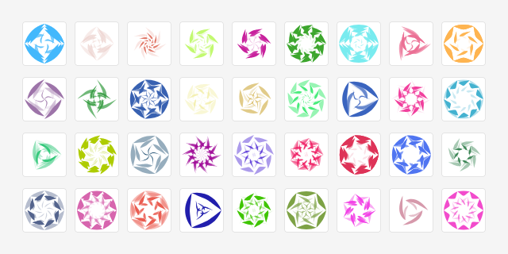
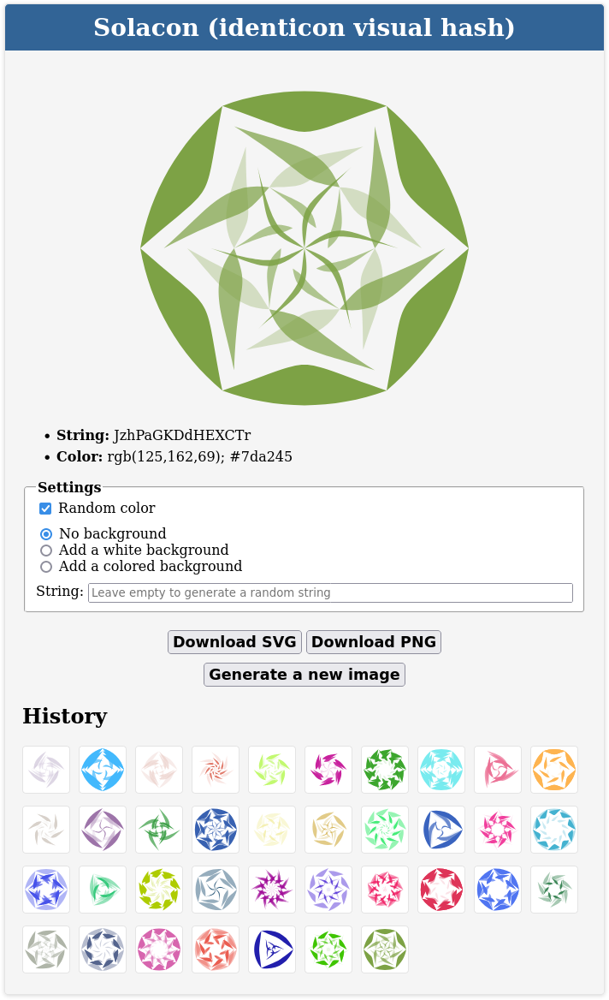

# About Solacon

A *solacon* is a variation of an [identicon](https://en.wikipedia.org/wiki/Identicon), in the form of a solar/spiral/floral shape. This is also known as a *visual hash*.

The solacon is **seeded with a value** (string) which determines the shape, symmetry, and shades of the image.

## Examples



## Form

The HTML file contains a form allowing to customize the image generation:

- **Random color:** If checked, a new color will be used for each image generation.
- **Background:** We can choose between no background (image with transparency), a white background or a colored background (shade of the main colour).
- **String:** If filled, the string will be used to generate the solacon. If empty, a random string will be used.

At the end of the form, there are buttons to generate a new image or to download the solacon in PNG or SVG format.



## GET variables

The image generation can also be customised using GET variables in the URL. Here is the list of all variables that can be used:

- `string=TEXT` where `TEXT` is the string used to generate the solacon. Example: `string=lorem`.
- `color=COLOR` where `COLOR` is the color of the solacon. Hex colors and RGB colors can be used. Examples: `color=#326496`, `color=326496`, `color=50,100,150`, `color=rgb(50,100,150)`.
- `background=TYPE` where `TYPE` is `white` or `colored`.
- `size=SIZE` where `SIZE` is the width and height in px. Example: `size=512`.
- `download=TYPE` where `TYPE` is `png` or `svg`. The image download will start automatically without having to click on the download button.

Example:

	index.html/?string=Lorem%20Ipsum&color=326496&background=white&download=png

## JavaScript

The parent document can alter the solacon:

```javascript
var svgObj = document.getElementById('svg-obj');
svgObj.setRGB('100, 150, 200');
svgObj.generate('some new value');
svgObj.setRGB();         // random color
svgObj.generate();       // random seed value
svgObj.setRGBFromHash(); // color is based off hashValue (default behavior)
svgObj.refresh();        // applies color change to current shape
```

## Live demo

Try out some [dynamical examples](https://naknomum.github.io/solacon-example/) of **solacons** in action.

## Similar projects

- [Hexicon.js](https://github.com/naknomum/hexicon): hexagonal identicons
- [Awesome Identicons](https://github.com/drhus/awesome-identicons): a curated list of *visual hashes* maintained by **Husam ABBOUD**

## License

Copyright (c) 2022  Jon Van Oast <https://github.com/naknomum>  
Copyright (C) 2023  Misaki F. <https://github.com/misaki-web>

Released under MIT License. See the file [LICENSE](LICENSE) for more details.